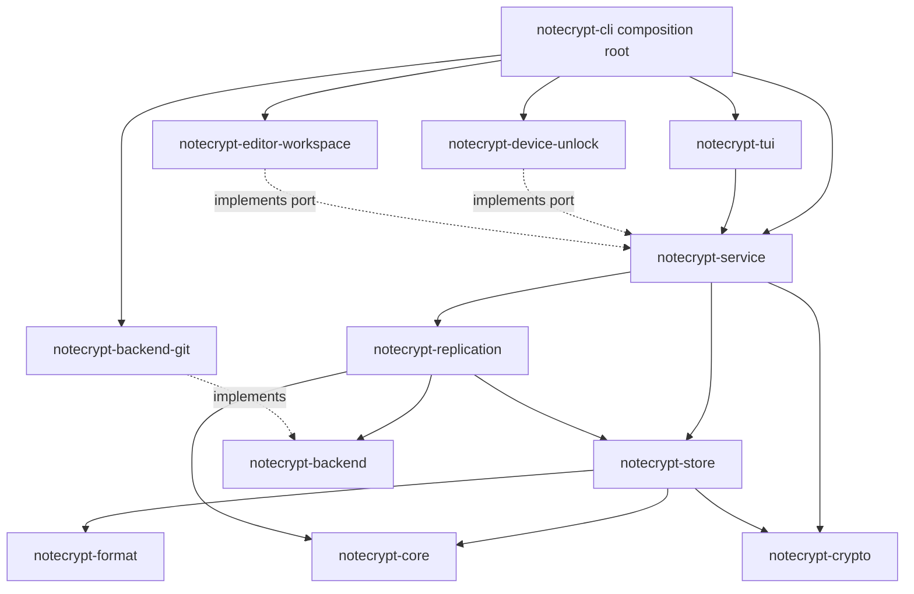

# Notecrypt Phase 1 Design

## Status

Approved for implementation planning on 2026-08-17.

## Product Summary

Notecrypt is a local-first encrypted arbitrary-file vault.
The encrypted vault can be stored in a public GitHub or GitLab repository without exposing file contents, logical filenames, extensions, or directory names.
Phase 1 provides a Rust core, a command-line interface, and a polished terminal user interface.
Future macOS, Windows, iOS, Android, and web clients consume the same versioned core concepts without embedding user-interface concerns in the security core.

Notecrypt has no hosted account service and no Notecrypt-owned storage server.
The user owns the encrypted objects and selects a replaceable synchronization backend.
Git is the first backend.

## Phase 1 Outcome

At the end of phase 1, a user can:

- Initialize a vault in an empty local directory or a dedicated Git repository.
- Recover the vault on another computer using the encrypted repository and recovery passphrase.
- Unlock the vault using the recovery passphrase.
- Optionally configure a device-local unlock slot backed by the operating-system credential store.
- Browse the logical file tree in the TUI without exposing names in the encrypted repository.
- Create, import, edit, rename, move, export, and delete text or binary files.
- Edit one selected file through a configured blocking editor command.
- Open a temporary plaintext representation of the entire vault for a bounded period.
- Continuously encrypt stable saved changes without blocking TUI interaction.
- Lock automatically after inactivity or at an absolute session deadline.
- Synchronize encrypted snapshots through Git.
- Run `notecrypt vault backup` to validate, commit, push, and verify the encrypted repository.
- Preserve both versions of concurrent edits instead of silently overwriting content.
- See clear progress, warnings, conflicts, cleanup failures, and recovery actions.

## Non-Goals

Phase 1 does not provide:

- A Notecrypt-hosted storage or identity service.
- A browser application, native mobile application, or native desktop GUI.
- A built-in full-screen text editor.
- Real-time collaborative editing.
- CRDTs or automatic content-level merging.
- Cross-vault deduplication.
- File sharing between different users.
- App-specific low-entropy PIN unlocking without an operating-system protected retry counter.
- A claim that plaintext cannot be observed by a compromised operating system, administrator, debugger, editor, keylogger, or screen-capture tool.
- Immediate opening of an arbitrarily large full-vault plaintext workspace.
- Secure deletion guarantees on modern copy-on-write filesystems or SSDs.

## User Experience Principles

Security wins at the final lock deadline.
The application warns early enough for the user to save editor buffers before that deadline.
Notecrypt never claims to have saved data that exists only in an editor's memory.
The user interface stays responsive while cryptography, filesystem operations, and Git operations run on workers.
Targeted editing performs work proportional to the selected file revision, not to total vault size.
Long operations provide progress, cancellation where safe, and an honest durability state.
Plaintext is never written inside the encrypted Git worktree.

## Threat Model

### Protected assets

- File contents.
- Logical filenames, extensions, and directory names.
- Vault tree structure.
- Recovery and device-unlock key material.
- Integrity and authenticity of objects, metadata, snapshots, and the active vault head.
- Previously observed snapshot freshness on an existing device.

### Adversaries in scope

- A person who obtains a copy of the encrypted repository.
- A public Git host or storage backend that reads, changes, deletes, reorders, or replays stored data.
- An attacker who replaces one valid encrypted object with another valid object from a different context.
- Accidental user attempts to commit plaintext.
- Process crashes and power loss during a local vault transaction.
- Concurrent synchronization from multiple devices.
- Malformed, oversized, truncated, or adversarial encrypted objects.

### Adversaries outside the confidentiality guarantee

- Malware or an administrator observing an unlocked process, its memory, or its files.
- A malicious editor opened on plaintext.
- A compromised kernel, credential store, terminal, keyboard, screen, or hardware.
- Forensic recovery after the operating system or storage device has copied plaintext outside Notecrypt's control.
- Denial of service by a backend that withholds or destroys data.

Notecrypt still minimizes local plaintext lifetime and surface area against out-of-scope adversaries.
These measures are defense in depth and are never described as absolute protection.

### Rollback limitation

An existing device stores its last trusted snapshot identity outside the encrypted repository and detects a remote that moves behind it.
A new device recovering from only a passphrase and a malicious remote cannot prove that the remote supplied the newest valid snapshot.
The recovery flow must disclose this limitation.

## Architecture

The repository is a Cargo virtual workspace with resolver version 3.
All phase 1 crates are private workspace crates with `publish = false`.
Internal Rust APIs are not an external compatibility promise unless explicitly promoted later.

```text
notecrypt/
├── crates/
│   ├── notecrypt-core/
│   ├── notecrypt-format/
│   ├── notecrypt-crypto/
│   ├── notecrypt-store/
│   ├── notecrypt-backend/
│   ├── notecrypt-replication/
│   └── notecrypt-service/
├── adapters/
│   ├── notecrypt-backend-git/
│   ├── notecrypt-device-unlock/
│   └── notecrypt-editor-workspace/
├── ui/
│   └── notecrypt-tui/
└── apps/
    └── notecrypt-cli/
```



### `notecrypt-core`

This crate owns deterministic domain behavior.
It defines vault, device, file, revision, object, snapshot, tombstone, and conflict identities.
It defines immutable logical trees and deterministic reconciliation transitions.
It has no filesystem, cryptography, Git, UI, keyring, asynchronous runtime, or serialization responsibilities.

### `notecrypt-format`

This crate owns canonical and bounded byte formats.
It defines explicit format versions, object headers, key slots, encrypted metadata envelopes, file manifests, snapshot records, and decoding limits.
It contains golden fixtures for every supported durable format version.
It identifies cryptographic algorithms but does not implement them.

### `notecrypt-crypto`

This crate owns reviewed cryptographic composition.
It provides Argon2id passphrase derivation, XChaCha20-Poly1305 authenticated encryption, HKDF-SHA-256 domain-separated subkeys, keyed BLAKE3 chunk fingerprints, random object identities, random data keys, and streaming chunk encryption.
It exposes secret-bearing types that do not implement `Clone`, `Debug`, `Display`, or serialization traits.
It zeroizes owned secret buffers on drop on a best-effort basis.

### `notecrypt-store`

This crate owns the local encrypted object repository and transaction boundary.
It stages immutable objects, flushes durable data, publishes authenticated snapshots, atomically advances the trusted local head, maintains a recovery journal, and recovers incomplete transactions.
It also stores trusted local freshness state outside the sync repository.
It owns an injectable durability port for file flush, directory flush, atomic replacement, and platform capability reporting.
Unix, macOS, and Windows implementations remain internal store modules, while fault tests inject a deterministic fake.
The store exposes a repository trait implemented by `VaultStore` so service tests can use blocking and failing fakes without depending on adapter crates.
Key-required reads, mutations, recovery, and replication access exist only on revocable unlocked capabilities.
Raw store helpers remain crate-private so no caller can bypass session lock or key revocation.

### `notecrypt-backend`

This crate owns the backend service-provider interface.
It contains backend-neutral opaque object and head types plus explicit capability and limit declarations.
It provides a reusable conformance test suite for backend adapters.

### `notecrypt-replication`

This crate owns synchronization and migration workflows.
It fetches encrypted objects, requests authentication through the store, compares snapshots, reconciles logical metadata, preserves conflicts, publishes with an expected remote head, verifies readback, and resumes interrupted backend migrations.
It never depends directly on Git.

### `notecrypt-service`

This crate is the in-process application facade used by all phase 1 user interfaces.
It owns unlock sessions, operation handles, progress events, cancellation, inactivity policy, edit workflows, whole-vault workflows, and ports for editor workspaces and device unlocking.
It does not expose Tokio, Git library, serialization-library, or cryptographic-library types in its public interface.
The service owns every request, result, and safe error DTO appearing in those host-port traits.
Adapters depend inward on those traits and the service never depends on an adapter crate.
The store returns an opaque `UnlockedVault` capability that owns cryptographic key material and authenticated repository operations.
The service owns the user-visible unlock session, timers, cancellation, and policy while holding that capability until lock.
Replication workers receive only bounded leases from the same capability and therefore stop at the same revocation boundaries as local edits.

### Adapters

`notecrypt-backend-git` implements encrypted-object replication using the installed Git executable through argument arrays, never through a shell.
This choice preserves mature GitHub and GitLab authentication across the three desktop operating systems.
The adapter validates repository state, isolates command arguments, disables command aliases, constructs commits through plumbing commands that bypass worktree content filters and hooks, and treats Git output as untrusted input.

`notecrypt-device-unlock` integrates with the native credential store.
Failure or absence of a supported credential store falls back to recovery-passphrase unlock.

`notecrypt-editor-workspace` creates and supervises plaintext workspaces outside the encrypted repository.
It provides platform-specific restrictive permissions and best-effort indexing and backup exclusions.

### UI and application

`notecrypt-tui` owns only terminal rendering, keyboard input, navigation, dialog state, and conversion of service events into user-visible status.
`notecrypt-cli` is the composition root that parses commands, loads local configuration, constructs adapters, starts the service, and runs either command output or the TUI.

## Dependency Rules

- UI crates may depend on the service facade but not on store, crypto, format, replication, or backend implementations.
- Adapter crates implement ports but do not define domain policy.
- Core cannot depend on any other Notecrypt crate.
- Format and crypto remain independent implementations consumed by the store.
- Service may depend on `notecrypt-crypto` only for the opaque, non-cloneable device-wrapping secret container used by its native-unlock port.
- No service command, result, event, UI DTO, or loggable type exposes the secret container or its bytes.
- The store translates format-owned numeric wire identifiers into a crypto-owned authenticated-context value containing only bounded primitive fields.
- Replication depends on backend abstractions and authenticated store operations, never on a concrete backend.
- Git types cannot appear outside `notecrypt-backend-git`.
- Tokio types cannot appear in public service, core, format, crypto, store, backend, or replication signatures.
- `anyhow` errors cannot cross a crate's public boundary.
- Durable data never relies on Rust type layout or default serializer behavior.
- Cargo features are additive capabilities, not mutually exclusive backend selectors.

CI enforces these rules using package-level dependency checks and platform build matrices.

## Vault Storage Model

The encrypted repository contains only a small public bootstrap header, encrypted immutable objects, and an authenticated opaque head reference.

```text
vault-root/
├── .notecrypt-vault
├── objects/
│   └── ab/
│       └── <opaque-object-id>
└── head
```

`.notecrypt-vault` contains only the magic value, vault-format version, random vault identifier, KDF parameters, and recovery wrapped-key slots.
It contains no logical names, file extensions, directory structure, remote credentials, or plaintext description.

The local device stores the following outside the encrypted repository:

- A mapping from vault ID to local path.
- Backend type and non-secret backend configuration.
- Credential-store references rather than credentials.
- Device-local wrapped-root-key slot records.
- Last trusted local and remote snapshot identities.
- Incomplete local transaction records.
- Registered plaintext workspaces requiring cleanup.

The encrypted object graph contains:

- Fixed-size or bounded variable-size content chunks.
- Per-file revision manifests.
- Encrypted logical tree metadata.
- Tombstones.
- Conflict records.
- Snapshot records with one or more parents.

Logical filenames and metadata are visible only after unlock.
Object sizes, object counts, update timing, and reuse of unchanged encrypted chunks remain observable.
Chunk reuse reveals which fixed-size regions did not change between revisions of the same file.
Phase 1 accepts this within the previously selected observable-change model because it avoids re-encrypting unchanged fixed-size regions after aligned or in-place edits.
A byte insertion or deletion can shift chunk boundaries and require re-encrypting all subsequent chunks.
Notecrypt never performs cross-file or cross-vault deduplication.

## Key Hierarchy

Vault creation generates a random 256-bit Vault Root Key.
The recovery passphrase derives a Recovery Key Encryption Key through Argon2id using versioned parameters and a random salt.
The Recovery Key Encryption Key wraps the Vault Root Key.
The passphrase is never stored.

The Vault Root Key derives separate keys for:

- Metadata encryption.
- Snapshot authentication.
- Keyed chunk comparison fingerprints.
- Content-key wrapping.
- Local verification markers.

The local-verification key authenticates trusted-head, migration, cleanup, and device-slot records with distinct record-type labels.
Passphrase unlock derives this key before trusting existing local state.
Device unlock first authenticates the wrapped root key with the OS-protected device key, derives the local-verification key, and then verifies the complete slot and trusted-state records.
Authentication failure disables device unlock and requires passphrase recovery plus explicit local-state repair.

Each newly encrypted content chunk receives a fresh random data key, random object identity, and random nonce.
The chunk data key is wrapped by a vault-derived wrapping key.
The encrypted file-revision manifest contains the ordered chunk identities, keyed plaintext fingerprints, individual plaintext lengths, and total plaintext length.
The keyed fingerprints are visible only after unlock and allow reuse of an unchanged chunk at the same position in the same logical file.
Chunk encryption authenticates the vault ID, object type, format version, file identity, random object identity, and plaintext length.
The revision manifest authenticates the revision identity, chunk order, chunk count, total plaintext length, and every referenced chunk identity.
This split permits explicit same-file chunk reuse while making substitution, reordering, deletion, duplication, and truncation fail authentication.

A device-unlock slot wraps the same Vault Root Key using a random key protected by the native credential store.
The resulting wrapped Vault Root Key and credential-store reference are stored together in a device-local slot record outside the replicated repository.
Enrollment and removal use the trusted local-state transaction mechanism.
An app-specific PIN is permitted only when the operating system supplies device binding and a protected retry counter.
Otherwise phase 1 uses the passphrase or operating-system-native unlock prompt.

## Local Transaction Model

A local mutation follows this order:

1. Read and authenticate the current trusted snapshot.
2. Create new immutable content, manifest, tree, and snapshot objects in a transaction staging directory.
3. Flush each staged file and required containing directories according to the platform durability adapter.
4. Verify every staged object by reading and authenticating it.
5. Move immutable objects into the object repository without replacing existing objects.
6. Write an authenticated journal record describing the intended head transition.
7. Atomically replace the local head.
8. Flush the head and parent directory.
9. Update trusted local freshness state.
10. Mark the journal transaction complete.

Recovery either completes an authenticated head transition whose objects are durable or discards unreachable staged objects.
Recovery never guesses from unauthenticated filenames or timestamps.

## Targeted Edit Workflow

The user selects one logical file through the TUI or CLI.
After successful unlock, Notecrypt authenticates the selected revision and decrypts only that file into a random restricted workspace outside the repository.
Notecrypt launches a configured editor command that must remain attached until editing is complete.
Built-in profiles supply blocking flags for common GUI editors.
Strict mode rejects editor commands that detach and cannot be supervised.

The workspace watcher debounces independently per logical path and waits until a write is stable across a bounded quiet interval.
It treats in-place writes, truncate-and-rewrite saves, and temporary-file rename saves as equivalent candidates.
After the quiet interval it opens a stable source handle, records file identity, size, modification metadata, and path generation, and then streams from that handle.
Before publication it verifies that the observed generation is still current.
If the source changed, it discards the temporary ciphertext and retries without publishing stale output.
It streams the saved bytes into authenticated chunks on a worker.
Unchanged chunks are reused when their keyed plaintext fingerprint matches the previous revision.
Changed chunks receive new encryption and immutable object identities.
The resulting revision is committed through the local transaction model.

The TUI reports separate states for detected, encrypting, durable, synchronized, conflicted, and failed.
The UI may acknowledge a detected save immediately but must not call it durable before the local head transaction succeeds.

On editor exit, Notecrypt performs a final stable read, commits any remaining saved change, removes the plaintext workspace, erases session keys when no other operation needs them, and reports cleanup failures prominently.

## Whole-Vault Workflow

`notecrypt vault open --for <duration>` creates a temporary external plaintext workspace.
It materializes the logical directory tree and decrypts files through a bounded worker pool.
Metadata and small files are prioritized so the workspace becomes useful quickly.
Large files continue with visible progress.
Notecrypt does not create misleading zero-byte placeholders that an editor could overwrite before materialization completes.
Each file decrypts into staging outside the watched tree and becomes visible through an atomic publication carrying a suppression generation.
The watcher establishes a baseline and arms that path only after publication, so Notecrypt-created files are not mistaken for user edits.
Any genuine edit after publication receives a later path generation and is preserved while other files continue materializing.

The watcher recognizes file creation, modification, rename, move, and deletion.
It validates paths against traversal, symlink, special-file, reserved-name, Unicode-normalization, and case-collision rules before importing changes.
Phase 1 imports regular files and directories only.
Symlinks, sockets, device files, named pipes, hard-link identity, and filesystem metadata streams are rejected with a clear explanation.
Sparse files are rejected by default because silently materializing holes can cause extreme storage growth.
An explicit import option may materialize a sparse file only after reporting the resulting logical size.

The session has both an inactivity timeout and an absolute deadline.
The absolute deadline is never extended by activity.
The inactivity timer resets only on trusted local user actions, not on sync traffic or arbitrary watcher noise.

## Auto-Lock Workflow

Notecrypt warns at configurable intervals before the lock deadline.
It states that editor buffers not saved to disk cannot be recovered by Notecrypt.
At the deadline it stops accepting new mutations, waits for the current stable write within a short bounded grace period, commits the latest saved revision, requests graceful editor termination, and then terminates the supervised editor if required.

Notecrypt next removes registered plaintext workspaces and erases session key material.
If removal fails, cryptographic access still locks, but the application reports a critical plaintext-residue warning and records the path for cleanup on next start.
It never reports a clean lock while cleanup remains unconfirmed.

The next startup processes the cleanup registry before allowing a vault unlock.

## Snapshot and Conflict Model

Every logical file has a stable random file identity independent of its path.
Every saved revision has a new revision identity and references one ordered list of encrypted content chunks.
Every snapshot references its parent snapshots and one encrypted logical tree root.

Synchronization finds the nearest authenticated common ancestor.
Independent changes to different file identities merge structurally.
The following changes produce an explicit conflict:

- Two different revisions of the same file identity.
- Rename or move of the same file identity to different destinations.
- Delete versus modify.
- Two different file identities created at paths that collide after platform normalization.

Conflict reconciliation is deterministic.
It preserves the original logical entry and an additional conflict entry containing the conflicting device label and short snapshot identity.
Delete-versus-modify preserves the modified content and records the competing tombstone.
No phase 1 operation silently discards or automatically merges file bytes.

## Backend Contract

A backend declares support for:

- Reading the current opaque remote head.
- Listing object inventory in bounded pages.
- Fetching immutable objects by opaque ID.
- Publishing a bounded batch of immutable object streams and a replacement head conditional on an expected prior head version.
- Reading back published state.
- Reporting object-size, batch-size, and concurrency limits.

Publication is the backend transaction boundary.
On success every object referenced by the replacement head is remotely readable and the new head is observable.
On a stale expected head, the head remains unchanged, although unreachable immutable objects may remain for later repair or collection.
Git satisfies this contract by building one local commit containing the batch and pushing its dedicated branch with fast-forward protection.
Object-store backends may upload immutable objects first and then conditionally replace their head object.
When a backend cannot determine whether a publication succeeded, it returns an indeterminate outcome and reconciliation rereads the remote head before retrying.

Backends without conditional head replacement cannot support unrestricted multi-writer synchronization.
They must advertise the limitation and run only in an explicitly selected single-writer mode.

One backend is active and writable for a device at a time.
Migration uses a separately configured target, copies and verifies all reachable encrypted objects, conditionally publishes the target head, records completion, and only then permits switching the active backend.
Optional backup targets are read-only destinations from Notecrypt's perspective.

## Git Backend

The Git backend stores only the encrypted vault layout and Notecrypt metadata needed to recognize the dedicated vault branch.
The adapter invokes Git directly with explicit arguments and never interpolates input into a shell command.
Vault paths, ref names, and remote names are validated before invocation.
Git credentials remain under the user's Git credential configuration and are not copied into vault configuration.

Synchronization performs fetch, authenticates reachable Notecrypt objects, reconciles snapshots if required, creates a Git tree and commit from a validated encrypted-file inventory using plumbing commands, and performs a normal fast-forward push from a private temporary ref.
Notecrypt-generated commits use a fixed neutral author and committer identity and contain no logical vault name or file name in the commit message.
Commit timestamps and remote account identity remain observable.
A rejected push triggers a bounded refetch and reconciliation retry rather than an overwrite.
The adapter advances its visible local tracking ref only after reading and verifying the resulting remote reference.
If the remote may have accepted a push but the response or verification read fails, the adapter reports an indeterminate outcome and the replication workflow rereads the remote head before taking another action.

Onboarding installs managed defense-in-depth hooks that reject known plaintext workspaces and unexpected files.
Hooks are not the confidentiality boundary because users and tools can bypass them.
`notecrypt vault backup` independently validates the encrypted layout before committing or pushing.

## Application Service Contract

The service exposes versioned command and result types for Rust consumers.
Long operations return an opaque operation handle.
The handle provides non-blocking progress polling, explicit cancellation, and a terminal result.
Ordinary commands use a bounded work queue.
Explicit lock, deadline expiry, operating-system suspend, cancellation, and trusted user activity use a separate non-rejectable control path that is processed before ordinary work.
The TUI reports local keyboard and navigation activity through a coalesced trusted-activity signal.

Events include:

- Operation started.
- Phase changed.
- Items and bytes completed.
- Save detected.
- Revision durable.
- Sync published.
- Warning.
- Conflict.
- Cleanup required.
- Operation completed or failed.

Progress events never contain plaintext names unless the UI request is associated with an unlocked local session.
Logs use opaque IDs and coarse sizes by default.
Diagnostics that expose logical names require an explicit local opt-in and are never enabled automatically.

## TUI Design

The TUI uses `ratatui` with `crossterm` and remains a presentation layer over `notecrypt-service`.

The default layout contains:

- A vault and session status header.
- A searchable logical file tree.
- A details and activity pane.
- A persistent command hint bar.
- Modal dialogs for unlock, create, import, rename, move, delete, conflicts, settings, and destructive confirmations.

Primary actions include:

- Open or edit the selected file.
- Create a note or directory.
- Import or export a file.
- Rename, move, or delete.
- Lock immediately.
- Open the bounded whole-vault workspace.
- Synchronize.
- Run backup.
- Inspect and resolve conflicts.

The TUI redraw loop never performs cryptography, disk traversal, Git invocation, passphrase derivation, or blocking channel reads.
It renders the latest immutable view model and sends commands to the service.
Progress updates are coalesced to avoid flooding the terminal.

The CLI provides equivalent one-shot non-interactive commands and a versioned `--output json` mode for automation.
Each protected CLI invocation prompts, unlocks for that operation, and locks before process exit.
Phase 1 does not expose standalone CLI `unlock` or `lock` commands because unlock sessions are process-local and cross-process control requires a separately designed authenticated IPC owner.
The human TUI is not implemented by parsing CLI text output.

## Performance Requirements

Performance is a product requirement and a security constraint because long blocking operations encourage unsafe workarounds.
Measurements must be taken before optimization and retained as regression baselines.
Release measurements use a documented reference machine with at least four modern CPU cores, 16 GiB of memory, and local SSD storage.
Reports separate p50, p95, p99, throughput, peak resident memory, cold filesystem cache, warm filesystem cache, KDF time, editor startup, Git time, network time, and antivirus interference where applicable.

### Hard architectural requirements

- Targeted edit performs no full-vault scan, decryption, or encryption.
- The TUI input and redraw path performs no blocking cryptographic, filesystem, keyring, Git, or network operation.
- File content is streamed through bounded buffers.
- Whole-vault materialization and synchronization use bounded concurrency and bounded memory.
- Saved revisions reuse unchanged encrypted chunks within the same file when safe to do so.
- Metadata needed for browsing is authenticated and cached only for the lifetime of the unlocked session.
- A save creates at most one active encryption pipeline per logical file.
- Newer stable filesystem state supersedes queued obsolete work before encryption begins.
- Per-path work is serialized and watcher queues are bounded with backpressure.
- Local ciphertext publication completes before Git synchronization begins.
- Network and Git work never block editing or local durability acknowledgement.
- Durability, authentication, and final lock cleanup are never skipped to meet a latency target.

### Initial latency budgets

These budgets apply on representative supported desktop hardware and become calibrated platform baselines during implementation.

| Operation | Phase 1 budget |
| --- | --- |
| CLI startup without unlock or vault scan | p95 below 75 ms |
| TUI keypress to visible response | p95 below 50 ms |
| Browse or filter 10,000 unlocked logical entries | p95 below 100 ms |
| Warm device unlock after native approval | p95 below 300 ms, excluding operating-system prompt time |
| Recovery passphrase derivation | calibrated to 750-1500 ms on the current device |
| Open an unlocked 1 MiB targeted file | p95 below 200 ms on local SSD storage |
| Make a 1 MiB saved revision locally durable | p95 below 350 ms after the final filesystem event, including stable-write debounce |
| Progress refresh during long work | at least 10 updates per second, coalesced to terminal refresh rate |
| First busy feedback for work expected to exceed 250 ms | p95 below 100 ms |
| Service cancellation acknowledgement | p95 below 250 ms for cancellable phases |
| Idle TUI CPU use | below 1 percent on the benchmark machine |

The 100 MiB and 1 GiB cases use throughput and memory budgets rather than fixed latency claims.
Sustained authenticated read, encrypt or decrypt, and write throughput must reach at least 150 MiB per second on the reference machine.
Encryption and decryption must also remain within 20 percent of the measured direct-library streaming baseline after filesystem cost is separated.
Peak resident memory while processing a 10 GiB file must remain below 128 MiB above the configured KDF allocation at default concurrency.

The durable content chunk size is selected from 1 MiB, 2 MiB, and 4 MiB after measuring throughput, cancellation latency, memory, repository growth, and framing overhead.
The selected size is versioned in the file manifest.
Changing the durable default after format release requires an explicit format decision and compatibility test.

Chunk encryption uses a random nonce domain for every file revision and a provably unique nonce within that domain for every chunk.
Authenticated structure covers chunk order, chunk count, total plaintext length, and file identity so reordering, deletion, duplication, or truncation fails closed.
Phase 1 does not add compression because its length leakage, decompression limits, and performance tradeoffs require a separate decision.

### Stretch targets

- Fixed targeted-operation overhead below 40 ms.
- Sustained streaming throughput above 500 MiB per second on current Apple Silicon and hardware-accelerated x86-64.
- Targeted edit of a file up to 1 MiB below 100 ms.
- Durable encryption of a small save below 200 ms.
- TUI input-to-render latency below 16.7 ms at p95.

Stretch targets guide profiling but are not cross-platform release gates.

### Benchmark corpus

The checked-in generator produces deterministic non-sensitive corpora for:

- 10,000 notes between 1 KiB and 64 KiB.
- A mixed 10 GiB vault containing text, images, archives, audio, and video-shaped random data.
- One 1 GiB incompressible file.
- One 1 GiB file with a 4 MiB middle edit.
- One 10 GiB file for bounded-memory validation.
- Sparse files with small allocated size and large logical size.
- A 100,000-entry metadata-only tree.
- A conflict history with 1,000 snapshots.
- Editor saves using in-place writes, truncation, temporary-file rename, and rapid repeated writes while prior encryption is active.

CI runs smoke-sized budgets on every change.
Scheduled platform jobs run the full corpus on macOS, Linux, and Windows and publish only aggregate timing and memory data.
Benchmark and diagnostic output must never include real vault paths, filenames, content, passphrases, derived keys, or exact user file sizes.
Performance diagnostics use coarse power-of-two size buckets, bounded queue depth, worker utilization, operation phase, algorithm version, platform, and coarse error category.
Detailed tracing is local, explicit, and disabled by default.

### Honest limits

Opening or closing a large whole-vault workspace requires time proportional to the bytes that must be decrypted, encrypted, verified, and removed.
Notecrypt makes that work progressive and responsive but does not call it instantaneous.
Final lock may wait for the latest saved write within its bounded grace period because durability and cleanup take precedence over apparent speed.

## Error Model

Every public failure has a stable category, safe user message, retry classification, and optional opaque diagnostic ID.

Important categories include:

- Invalid passphrase or unavailable device unlock.
- Unsupported or malformed vault format.
- Object authentication failure.
- Rollback detected.
- Missing reachable object.
- Local durability failure.
- Workspace permission or cleanup failure.
- Editor supervision failure.
- Path or filesystem object rejected.
- Backend unavailable.
- Remote head changed.
- Conflict requiring user attention.
- Git repository safety validation failure.

Authentication failure never emits partial plaintext.
A failed local transaction never advances the trusted head.
A failed remote publish never rewrites the remote head unconditionally.
Cancellation is honored only at safe boundaries and never leaves a partially trusted snapshot.

## Configuration

Configuration precedence is:

1. Explicit command-line option.
2. Vault-specific local configuration.
3. Environment variable.
4. User-wide default.

`vault_root` is accepted as `--vault-root` or `NOTECRYPT_VAULT_ROOT`.
Secrets and passphrases are not accepted through command-line arguments because process listings and shell history can expose them.
Passphrases are read from a protected terminal prompt or a documented file-descriptor input intended for automation.

Portable local configuration uses platform-native application directories.
Backend credentials remain in Git credential management or the native credential store.
Replicated encrypted vault preferences are distinct from device-local configuration.

## Testing Strategy

### Unit and property tests

- Domain transitions and deterministic conflict outcomes.
- Canonical format round trips and rejection of non-canonical encodings.
- Cryptographic domain separation and authenticated-context substitution failures.
- Chunk boundary cases and streaming behavior.
- Path normalization, collision, traversal, and special-file rejection.
- State-machine transition validity.

### Compatibility tests

- Golden durable-format fixtures.
- Old-reader and new-reader behavior for supported versions.
- CLI JSON schema fixtures.
- Backend conformance suite.

### Crash and fault tests

- Crash after every local transaction step.
- Short writes, full disk, permission changes, interrupted renames, and failed directory flushes.
- Interrupted encryption and interrupted cleanup.
- Git fetch or push termination.
- Remote head races.

### End-to-end tests

- Initialize, edit through a real blocking test editor, lock, reopen, and verify content.
- Whole-vault create, rename, modify, delete, lock, reopen, and verify.
- Two-device Git synchronization with independent edits.
- Two-device conflict preservation.
- Public repository scan proving that logical names and known plaintext markers are absent.
- Recovery on a clean device using only repository and passphrase.
- TUI flows in a pseudo-terminal on Linux, macOS, and Windows-compatible terminal infrastructure.

### Security tests

- Fuzz every durable decoder and backend response parser.
- Assert secrets cannot be formatted through compile-time tests.
- Scan logs, crash reports, command arguments, Git commits, and repository paths for plaintext canaries.
- Verify KDF parameter floors and bounded decoder allocations.
- Run dependency auditing and license policy checks in CI.
- Obtain an independent cryptographic and storage-format review before describing the vault as suitable for sensitive PII in a public repository.

### Performance tests

- Criterion microbenchmarks for KDF, chunk encryption, object verification, manifest encoding, tree operations, and reconciliation.
- End-to-end latency measurements for targeted edit and durable save.
- Peak resident-memory tests for large-file streaming.
- TUI input-latency and idle-CPU tests while encryption and Git sync run.
- Regression thresholds compared with recorded platform baselines.

## Compatibility and Versioning

Notecrypt versions these contracts independently:

1. Vault bootstrap and encrypted object format.
2. Snapshot and logical layout format.
3. Sync backend SPI.
4. External application API when the first non-Rust UI is introduced.
5. CLI machine-readable output.

Durable readers reject unsupported future major versions without modifying the vault.
Migrations create a new verified snapshot and retain the previous reachable state until explicit garbage collection.

## Delivery Slices

### Slice 1: Runnable local vertical slice

The user can initialize a vault, unlock with a passphrase, create and edit one file through a supervised editor, lock, reopen, and browse through the TUI.
The encrypted repository contains no plaintext name or content.

### Slice 2: Durable arbitrary-file vault

The user can manage a full logical tree, import arbitrary regular files, use whole-vault mode, recover from crashes, and observe reliable autosave state.

### Slice 3: Portable Git synchronization

The user can synchronize two devices, preserve conflicts, migrate backend configuration, run backup, and verify the remote reference.

### Slice 4: Hardened phase 1 release

The release passes format compatibility, fault injection, fuzzing, plaintext-canary, cross-platform, TUI, and performance gates.
Public security language is limited to properties demonstrated by those tests and independent review.

## Acceptance Criteria

Phase 1 is complete only when:

- The CLI and TUI exercise the same service facade.
- Targeted editing never scans or decrypts the entire vault.
- A user can perform the complete local workflow without manually manipulating encrypted objects.
- A user can recover the vault on a clean second device using only the Git repository and passphrase.
- Concurrent Git-backed edits preserve both versions deterministically.
- The encrypted repository and Git history contain no plaintext canary, logical filename, extension, or directory name.
- Crash injection cannot produce a trusted head that references missing or unauthenticated objects.
- The TUI remains interactive during large-file encryption and Git synchronization.
- Measured latency and memory budgets pass on the supported platform matrix.
- Cleanup failures are visible and recoverable.
- Documentation explains the security guarantees, limitations, recovery procedure, and backup verification.
- Independent review has not identified an unresolved critical cryptographic or format flaw.
