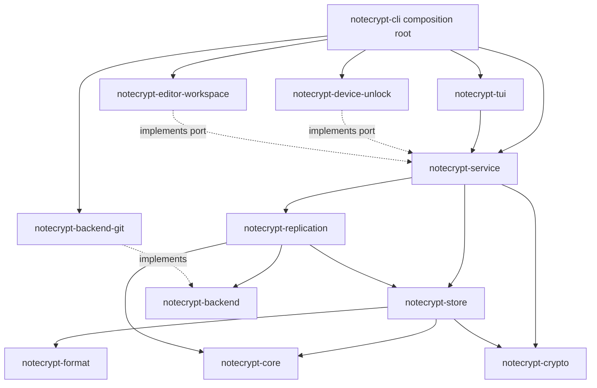

# Notecrypt Phase 1 Design

## Status

Approved for implementation planning on 2026-08-17.
Security and architecture preflight corrections were incorporated on 2026-08-17 before Task 2 began.
The unanimous contract re-review corrections were incorporated on 2026-08-17 before Task 2 began.
The non-forgeable capability and bounded-tooling corrections were incorporated on 2026-08-18 before Task 2 began.
The final typed-envelope, committed-transition, checkpoint, and Git-thread corrections were incorporated on 2026-08-18 before Task 2 began.

## Product Summary

Notecrypt is a local-first encrypted arbitrary-file vault.
The encrypted vault can be stored in a public GitHub or GitLab repository without exposing file contents, logical filenames, extensions, or directory names.
Phase 1 provides a Rust core, a command-line interface, and a polished terminal user interface.
Future macOS, Windows, iOS, Android, and web clients consume the same versioned core concepts without embedding user-interface concerns in the security core.

Notecrypt has no hosted account service and no Notecrypt-owned storage server.
The user owns the encrypted objects and selects a replaceable synchronization backend.
Git is the first backend.

## Phase 1 Outcome

At the end of phase 1, a user can:

- Initialize a vault in an empty local directory or a dedicated Git repository.
- Generate and display a cryptographically random recovery phrase once during initialization, confirm that it was recorded, and recover the vault on another computer using the encrypted repository and that phrase.
- Unlock the vault using the generated recovery phrase or an explicitly confirmed custom recovery passphrase.
- Optionally configure a device-local unlock slot backed by the operating-system credential store.
- Browse the logical file tree in the TUI without exposing names in the encrypted repository.
- Create, import, edit, rename, move, export, and delete text or binary files.
- Edit one selected file through a configured blocking editor command.
- Open a temporary plaintext representation of the entire vault for a bounded period.
- Continuously encrypt stable saved changes without blocking TUI interaction.
- Lock automatically after inactivity or at an absolute session deadline.
- Synchronize encrypted snapshots through Git.
- Run `notecrypt vault backup` to validate, commit, push, and verify the encrypted repository.
- Preserve both versions of concurrent edits instead of silently overwriting content.
- See clear progress, warnings, conflicts, cleanup failures, and recovery actions.

## Non-Goals

Phase 1 does not provide:

- A Notecrypt-hosted storage or identity service.
- A browser application, native mobile application, or native desktop GUI.
- A built-in full-screen text editor.
- Real-time collaborative editing.
- CRDTs or automatic content-level merging.
- Cross-vault deduplication.
- File sharing between different users.
- App-specific low-entropy PIN unlocking without an operating-system protected retry counter.
- A claim that plaintext cannot be observed by a compromised operating system, administrator, debugger, editor, keylogger, or screen-capture tool.
- Immediate opening of an arbitrarily large full-vault plaintext workspace.
- Secure deletion guarantees on modern copy-on-write filesystems or SSDs.

## User Experience Principles

Security wins at the final lock deadline.
The application warns early enough for the user to save editor buffers before that deadline.
Notecrypt never claims to have saved data that exists only in an editor's memory.
The user interface stays responsive while cryptography, filesystem operations, and Git operations run on workers.
Targeted editing performs work proportional to the selected file revision, not to total vault size.
Long operations provide progress, cancellation where safe, and an honest durability state.
Plaintext is never written inside the encrypted Git worktree.

## Threat Model

### Protected assets

- File contents.
- Logical filenames, extensions, and directory names.
- Vault tree structure.
- Recovery and device-unlock key material.
- Integrity and authenticity of objects, metadata, snapshots, and the active vault head.
- Previously observed snapshot freshness on an existing device.

### Adversaries in scope

- A person who obtains a copy of the encrypted repository.
- A public Git host or storage backend that reads, changes, deletes, reorders, or replays stored data.
- An attacker who replaces one valid encrypted object with another valid object from a different context.
- Accidental user attempts to commit plaintext.
- Process crashes and power loss during a local vault transaction.
- Concurrent synchronization from multiple devices.
- Malformed, oversized, truncated, or adversarial encrypted objects.

### Adversaries outside the confidentiality guarantee

- Malware or an administrator observing an unlocked process, its memory, or its files.
- A malicious editor opened on plaintext.
- A compromised kernel, credential store, terminal, keyboard, screen, or hardware.
- Forensic recovery after the operating system or storage device has copied plaintext outside Notecrypt's control.
- Denial of service by a backend that withholds or destroys data.

Notecrypt still minimizes local plaintext lifetime and surface area against out-of-scope adversaries.
These measures are defense in depth and are never described as absolute protection.

### Rollback limitation

An existing device stores its last trusted snapshot identity outside the encrypted repository and detects a remote that moves behind it.
A new device recovering from only a passphrase and a malicious remote cannot prove that the remote supplied the newest valid snapshot.
After bootstrap, head, and complete graph authentication, clean-device recovery returns `RecoveryFreshness::UnprovableOnCleanDevice` before establishing the first trusted-remote baseline.
This result is distinct from `RecoveryFreshness::Proven` and from `RollbackDetected` on an existing device.
CLI automation fails closed unless the user supplies the explicit freshness acknowledgement option.
The TUI presents a non-dismissible explanation and requires deliberate confirmation.
After acknowledgement, Notecrypt atomically records the accepted snapshot and provenance that freshness was accepted as unprovable rather than proven.
No output calls an older but cryptographically valid clean-device result latest or verified-fresh.

## Architecture

The repository is a Cargo virtual workspace with resolver version 3.
All phase 1 crates are private workspace crates with `publish = false`.
Internal Rust APIs are not an external compatibility promise unless explicitly promoted later.

```text
notecrypt/
├── crates/
│   ├── notecrypt-core/
│   ├── notecrypt-format/
│   ├── notecrypt-crypto/
│   ├── notecrypt-store/
│   ├── notecrypt-backend/
│   ├── notecrypt-replication/
│   └── notecrypt-service/
├── adapters/
│   ├── notecrypt-backend-git/
│   ├── notecrypt-device-unlock/
│   └── notecrypt-editor-workspace/
├── ui/
│   └── notecrypt-tui/
└── apps/
    └── notecrypt-cli/
```



### `notecrypt-core`

This crate owns deterministic domain behavior.
It defines vault, device, file, revision, object, snapshot, tombstone, and conflict identities.
It defines immutable logical trees and deterministic reconciliation transitions.
It has no filesystem, cryptography, Git, UI, keyring, asynchronous runtime, or serialization responsibilities.

### `notecrypt-format`

This crate owns canonical and bounded byte formats.
It defines explicit format versions, object headers, key slots, encrypted metadata envelopes, file manifests, snapshot records, and decoding limits.
It contains golden fixtures for every supported durable format version.
It identifies cryptographic algorithms but does not implement them.

### `notecrypt-crypto`

This crate owns reviewed cryptographic composition.
It provides bounded Argon2id passphrase derivation, XChaCha20-Poly1305 authenticated encryption, HKDF-SHA-256 domain-separated subkeys, keyed BLAKE3 chunk fingerprints and local-state authenticators, random object identities, random data keys, recovery-phrase generation, and per-chunk encryption primitives.
It exposes secret-bearing types that do not implement `Clone`, `Debug`, `Display`, or serialization traits.
It zeroizes owned secret buffers on drop on a best-effort basis.
Every cryptographic random value comes from the operating-system CSPRNG.
A CSPRNG failure is a hard operation failure and no bootstrap, key slot, object, snapshot, local record, or head is published from that operation.

### `notecrypt-store`

This crate owns the local encrypted object repository and transaction boundary.
It stages immutable objects, flushes durable data, publishes authenticated snapshots, atomically advances the trusted local head, maintains a recovery journal, and recovers incomplete transactions.
It also stores trusted local freshness state outside the sync repository.
It owns an injectable durability port for file flush, directory flush, atomic replacement, and platform capability reporting.
Unix, macOS, and Windows implementations remain internal store modules, while fault tests inject a deterministic fake.
The store exposes a repository trait implemented by `VaultStore` so service tests can use blocking and failing fakes without depending on adapter crates.
Key-required reads, mutations, recovery, and replication access exist only on revocable unlocked capabilities.
Raw store helpers remain crate-private so no caller can bypass session lock or key revocation.
Streaming encryption and decryption acquire a short-lived key guard for one bounded chunk, verify the session generation before and after that chunk, and retain no raw key reference between chunks.
Replication receives a separate object-safe lease with explicit graph, time, byte, object-count, and quarantine-disk budgets.
Authenticated cleanup registration, activation, verification, and deregistration are store-capability operations.

### `notecrypt-backend`

This crate owns the backend service-provider interface.
It contains backend-neutral opaque object and head types plus explicit capability and limit declarations.
It includes bounded typed bootstrap read and create-if-absent operations.
It provides a reusable conformance test suite for backend adapters.

### `notecrypt-replication`

This crate owns synchronization and migration workflows.
It fetches encrypted objects, requests authentication through the store, compares snapshots, reconciles logical metadata, preserves conflicts, publishes with an expected remote head, verifies readback, and resumes interrupted backend migrations.
It proves that the complete authenticated graph is present before accepting or publishing a head.
It never depends directly on Git.

### `notecrypt-service`

This crate is the in-process application facade used by all phase 1 user interfaces.
It owns unlock sessions, operation handles, progress events, cancellation, inactivity policy, edit workflows, whole-vault workflows, and ports for editor workspaces and device unlocking.
It does not expose Tokio, Git library, serialization-library, or cryptographic-library types in its public interface.
The service owns every request, result, and safe error DTO appearing in those host-port traits.
Adapters depend inward on those traits and the service never depends on an adapter crate.
The store returns an opaque `UnlockedVault` capability that owns cryptographic key material and authenticated repository operations.
The service owns the user-visible unlock session, timers, cancellation, and policy while holding that capability until lock.
Replication workers receive only bounded leases from the same capability and therefore stop at the same revocation boundaries as local edits.
The service-owned workspace port carries an opaque stable-source handle and identity token so an adapter can validate the same source immediately before store publication.
The service owns bounded zeroizing recovery-secret input and one-time presentation types that travel only through dedicated secret methods, never ordinary commands, results, events, snapshots, JSON, logs, or diagnostics.

### Adapters

`notecrypt-backend-git` implements encrypted-object replication using one hardened installed-Git runner for onboarding, fetch, sync, backup, backend copy, and recovery.
This choice preserves mature GitHub and GitLab authentication across the three desktop operating systems.
The runner uses argument arrays without a shell, sanitizes Git configuration and environment state, constrains transports, validates repository identity on every operation, bypasses hooks for internal publication, and treats Git output as untrusted input.

`notecrypt-device-unlock` integrates with the native credential store.
Failure or absence of a supported credential store falls back to recovery-passphrase unlock.

`notecrypt-editor-workspace` creates and supervises plaintext workspaces outside the encrypted repository.
It provides platform-specific restrictive permissions and best-effort indexing and backup exclusions.
It implements the service-owned coordination port with Unix `flock` or `fcntl` semantics and Windows file-sharing or `LockFileEx` semantics.

### UI and application

`notecrypt-tui` owns only terminal rendering, keyboard input, navigation, dialog state, and conversion of service events into user-visible status.
`notecrypt-cli` is the composition root that parses commands, loads local configuration, constructs adapters, starts the service, and runs either command output or the TUI.

## Dependency Rules

- UI crates may depend on the service facade but not on store, crypto, format, replication, or backend implementations.
- Adapter crates implement ports but do not define domain policy.
- Core cannot depend on any other Notecrypt crate.
- Format and crypto remain independent implementations consumed by the store.
- Service may depend on `notecrypt-crypto` only for narrow consuming recovery-secret and device-wrapping secret bridges used by dedicated internal ports.
- No service command, result, event, UI DTO, or loggable type exposes the secret container or its bytes.
- The store translates format-owned numeric wire identifiers into a crypto-owned authenticated-context value containing only bounded primitive fields.
- Replication depends on backend abstractions and authenticated store operations, never on a concrete backend.
- Git types cannot appear outside `notecrypt-backend-git`.
- Tokio types cannot appear in public service, core, format, crypto, store, backend, or replication signatures.
- `anyhow` errors cannot cross a crate's public boundary.
- Durable data never relies on Rust type layout or default serializer behavior.
- Cargo features are additive capabilities, not mutually exclusive backend selectors.
- `notecrypt-format` owns numeric algorithm and profile identifiers, `notecrypt-crypto` owns typed authenticated contexts, and `notecrypt-store` performs the only explicit translation between them.

CI enforces these rules using package-level dependency checks and platform build matrices.

## Vault Storage Model

The encrypted repository contains only a small public bootstrap header, encrypted immutable objects, and an authenticated opaque head reference.

```text
vault-root/
├── .notecrypt-vault
├── objects/
│   └── ab/
│       └── <opaque-object-id>
└── head
```

`.notecrypt-vault` contains only the magic value, vault-format version, cryptographic-profile identifier, random vault identifier, KDF parameters, and recovery wrapped-key slots.
It contains no logical names, file extensions, directory structure, remote credentials, or plaintext description.
The bootstrap is immutable for one vault identity.
A backend may create it only when absent and must reject existing bytes that differ from the expected bootstrap.

The local device stores the following outside the encrypted repository:

- A mapping from vault ID to local path.
- Backend type and non-secret backend configuration.
- Credential-store references rather than credentials.
- Device-local wrapped-root-key slot records.
- Last trusted local and remote snapshot identities.
- Incomplete local transaction records.
- Authenticated cleanup records containing random workspace identities and lifecycle state, but never arbitrary cleanup paths.

The encrypted object graph contains:

- Fixed-size or bounded variable-size content chunks.
- Per-file revision manifests.
- Encrypted logical tree metadata.
- Tombstones.
- Conflict records.
- Snapshot records with one or more parents.

Logical filenames and metadata are visible only after unlock.
Object sizes, object counts, update timing, and reuse of unchanged encrypted chunks remain observable.
Chunk reuse reveals which fixed-size regions did not change between revisions of the same file.
Phase 1 accepts this within the previously selected observable-change model because it avoids re-encrypting unchanged fixed-size regions after aligned or in-place edits.
A byte insertion or deletion can shift chunk boundaries and require re-encrypting all subsequent chunks.
Notecrypt never performs cross-file or cross-vault deduplication.

## Key Hierarchy

Vault creation generates a random 256-bit Vault Root Key.
The default recovery credential is version-1 BIP39 English encoding of 128 CSPRNG bits as 12 words plus checksum.
Initialization displays that generated phrase once, requires exact confirmation before publishing the initial head, and never stores the phrase.
The recovery phrase derives a Recovery Key Encryption Key through Argon2id using versioned parameters and a random 128-bit salt.
The Recovery Key Encryption Key wraps the Vault Root Key.
The public bootstrap and recovery wrapper form an offline verifier for guessed recovery credentials.
Argon2 only slows offline guessing and does not turn a user-selected weak passphrase into a strong credential.

Custom recovery passphrases use policy version 1.
The accepted policy is 20 through 1,024 UTF-8 bytes, at least five whitespace-delimited words, no NUL, and byte-preserving input with no silent Unicode normalization.
Selecting a custom passphrase requires the explicit custom-recovery option, an offline-guessing warning, and a second matching entry before publication.
Interactive input that does not meet the policy is rejected rather than silently weakened.
Non-interactive initialization uses a protected file descriptor, requires the explicit offline-risk acceptance option, requires a second confirmation file descriptor, and fails closed when either descriptor is absent, reused, mismatched, outside the size limits, or attached to a terminal.

Argon2id profile 1 has a 16-byte salt, 32-byte output, a floor of 65,536 KiB, three iterations, and one lane, and a ceiling of 1,048,576 KiB, ten iterations, and sixteen lanes.
Every serialized KDF value is checked before conversion to library or platform integer types.
Values above a ceiling, below a floor, equal to `u32::MAX`, or overflowing a byte-count or allocation conversion are rejected before allocation or computation.
Calibration stays within these bounds and targets 750 to 1,500 ms without reducing the floor.
Cancellation is checked before Argon2 begins and again after it returns but before any derived key, wrapper, bootstrap, or head is published.
Phase 1 does not claim that the selected Argon2 implementation is interruptible during one library call.

The Vault Root Key derives separate keys for:

- Metadata encryption.
- Snapshot authentication.
- Keyed chunk comparison fingerprints.
- Content-key wrapping.
- Local verification markers.

The local-verification key authenticates trusted-head, migration, cleanup, and device-slot records with distinct record-type labels.
Passphrase unlock derives this key before trusting existing local state.
Device unlock first authenticates the wrapped root key with the OS-protected device key, derives the local-verification key, and then verifies the complete slot and trusted-state records.
Authentication failure disables device unlock and requires passphrase recovery plus explicit local-state repair.

## Durable Cryptographic Profile

Cryptographic profile 1 is immutable once golden fixtures ship.
All multi-field AAD and MAC inputs use canonical length-delimited `minicbor` arrays in the listed order.
All XChaCha20-Poly1305 tags are 16 bytes, all keyed BLAKE3 authenticators and fingerprints are 32 bytes, and all comparisons are constant time.
Wire algorithm identifiers are `0x0001` for XChaCha20-Poly1305, `0x0002` for keyed BLAKE3-256 authentication, `0x0003` for keyed BLAKE3-256 fingerprints, `0x0001` in the KDF namespace for Argon2id profile 1, and `0x0001` in the derivation namespace for HKDF-SHA-256 profile 1.
Outer AEAD AAD contains only public envelope fields in this order: profile identifier, vault identifier, object kind, format version, object identifier, nonce, and ciphertext length.
A field may be included only when the public envelope or an already authenticated parent reference makes it available.
Logical file and revision identifiers, snapshot parents and device identifiers, tree entry counts, chunk counts, total plaintext lengths, content sequence, KDF policy semantics, provider references, and all other protected structure remain inside ciphertext.
The content-chunk public envelope contains only its object ID, fresh random 24-byte nonce, ciphertext length, wrapped-key envelope when applicable, ciphertext, and tag.
Chunk sequence and plaintext length are fields of the encrypted payload, and profile 1 exposes no additional nonce metadata.
After successful authenticated decryption, the store validates every protected semantic against authenticated parent references, expected object kind, and profile bounds before returning a typed value.

| Durable kind | Construction and key domain | Nonce | Canonical AAD or MAC coverage | Authenticator and size limit |
| --- | --- | --- | --- | --- |
| Recovery slot, profile `0x0001` | XChaCha20-Poly1305 `0x0001` with the Argon2id recovery wrapping key | Fresh 24 CSPRNG bytes | Allowed public outer fields only; KDF and slot semantics are encrypted or independently required for key derivation and validated after decryption | AEAD tag; exactly 32 plaintext key bytes and at most 4 KiB encoded slot bytes |
| Device slot, profile `0x0001` | XChaCha20-Poly1305 `0x0001` with the native device wrapping key | Fresh 24 CSPRNG bytes | Allowed public outer fields only; slot and provider semantics remain inside ciphertext | AEAD tag; exactly 32 plaintext key bytes and at most 8 KiB encoded record bytes |
| Metadata envelope, profile `0x0001` | XChaCha20-Poly1305 `0x0001` with HKDF domain `notecrypt/metadata/v1` | Fresh 24 CSPRNG bytes | Allowed public outer fields only | AEAD tag; at most 1 MiB plaintext |
| Logical tree, profile `0x0001` | XChaCha20-Poly1305 `0x0001` with HKDF domain `notecrypt/metadata/v1` | Fresh 24 CSPRNG bytes | Allowed public outer fields only; entry count and graph shape remain inside ciphertext | AEAD tag; at most 256 MiB plaintext and 1,000,000 entries |
| Revision manifest, profile `0x0001` | XChaCha20-Poly1305 `0x0001` with HKDF domain `notecrypt/metadata/v1` | Fresh 24 CSPRNG bytes | Allowed public outer fields only; file ID, revision ID, chunk structure, and plaintext lengths remain inside ciphertext | AEAD tag; at most 64 MiB plaintext and 1,048,576 chunks |
| Snapshot, profile `0x0001` | XChaCha20-Poly1305 `0x0001` with the metadata key plus keyed BLAKE3 `0x0002` with HKDF domain `notecrypt/snapshot-authentication/v1` | Fresh 24 CSPRNG bytes for AEAD | Allowed public outer fields only; parents, tree reference, device ID, and plaintext length remain inside ciphertext; the outer MAC covers the complete canonical encrypted envelope | AEAD tag plus 32-byte MAC; at most 1 MiB plaintext and two parents |
| Authenticated head, profile `0x0001` | Keyed BLAKE3 `0x0002` with HKDF domain `notecrypt/snapshot-authentication/v1` | None | Crypto profile, head version, vault ID, snapshot ID, snapshot object ID, tree object ID, and complete canonical head payload | 32-byte MAC; at most 64 KiB encoded head bytes |
| Chunk-key wrapper, profile `0x0001` | XChaCha20-Poly1305 `0x0001` with HKDF domain `notecrypt/content-wrapping/v1` | Fresh 24 CSPRNG bytes | Allowed public outer fields only; file ID, sequence, plaintext length, and content semantics remain inside the wrapped payload or authenticated parent | AEAD tag; exactly 32 plaintext data-key bytes and at most 128 encoded wrapper bytes |
| Content chunk, profile `0x0001` | XChaCha20-Poly1305 `0x0001` with one fresh per-chunk data key | Fresh 24 CSPRNG bytes for each newly encrypted chunk | Allowed public outer fields only; content sequence, file identity, and plaintext length remain protected and are checked against the authenticated manifest after decryption | AEAD tag; at most 4 MiB plaintext plus 4 KiB framing |
| Same-position chunk fingerprint, profile `0x0001` | Keyed BLAKE3 `0x0003` with HKDF domain `notecrypt/chunk-fingerprint/v1` | None | File ID, checked chunk position, plaintext length, and plaintext bytes | 32-byte fingerprint; input is one bounded content chunk |
| Local-state record, profile `0x0001` | Keyed BLAKE3 `0x0002` with HKDF domain `notecrypt/local-verification/v1` and a distinct label for trusted head, trusted remote, backend copy, cleanup, or device slot | None | Crypto profile, local-state version, vault ID, record type, record ID, payload length, and complete canonical payload | 32-byte MAC; at most 64 KiB encoded record bytes |

`notecrypt-crypto` defines distinct typed public contexts and typed plaintext or authenticated values for every non-streaming profile row plus exact encrypt, decrypt, MAC, and verify operations.
The bounded chunk fingerprint, key-wrap, and content-chunk operations belong to the Task 4 streaming module.
The context constructors accept only public envelope fields and authenticated parent references and cannot accept protected semantics as outer AAD.
Crypto-owned private-field envelope-part types represent every AEAD result, snapshot outer authenticator, head authenticator, local-state authenticator, chunk-key envelope, content-chunk envelope, and chunk fingerprint named by the typed APIs.
Checked constructors validate public identity, kind, profile, nonce, ciphertext, tag, authenticator, fingerprint, and per-kind length before construction, while read-only or consuming accessors expose only public identity and authenticated bytes needed by the neutral format conversion.
These types expose no plaintext, key material, protected semantic field, formatting, serialization, or unchecked construction surface.
Cross-format cryptographic integration tests live in a neutral test package that depends on format and crypto, while format package tests remain structural and canonical only.
Wire tests prove that protected identifiers, graph shape, entry counts, chunk structure, and per-file semantics never appear in public bytes.
The store rejects cross-kind, cross-vault, wrong-object, wrong-version, wrong-length, wrong-slot, and modified-AAD substitutions before returning plaintext or trusted metadata.
Each newly encrypted content chunk receives a fresh random data key and random object identity.
The chunk data key is wrapped by the vault-derived content-wrapping key.
The encrypted file-revision manifest contains the ordered chunk identities, keyed plaintext fingerprints, individual plaintext lengths, and total plaintext length.
The keyed fingerprints are visible only after unlock and allow reuse of an unchanged chunk at the same position in the same logical file.
The store computes a candidate fingerprint and compares it with the previous descriptor at the same file position before selecting descriptor reuse or fresh encryption.
The revision manifest authenticates the revision identity, chunk order, chunk count, total plaintext length, and every referenced chunk identity.
This split permits explicit same-file chunk reuse while making substitution, reordering, deletion, duplication, and truncation fail authentication.

The store owns stream orchestration.
It checks the unlocked-session generation, acquires a key guard for one bounded chunk, performs fingerprinting and encryption or decryption, drops the guard, and checks the same generation again before accepting the chunk result.
No raw root, fingerprint, wrapping, metadata, or data-key reference survives between chunks.
Lock during a chunk prevents that chunk and all later work from entering a published revision.

A device-unlock slot wraps the same Vault Root Key using a random key protected by the native credential store.
The resulting wrapped Vault Root Key and credential-store reference are stored together in a device-local slot record outside the replicated repository.
Enrollment and removal use the trusted local-state transaction mechanism.
An app-specific PIN is permitted only when the operating system supplies device binding and a protected retry counter.
Otherwise phase 1 uses the passphrase or operating-system-native unlock prompt.

Rewrapping the same Vault Root Key is credential maintenance and not revocation because prior recovery or device wrappers remain in public Git history.
Phase 1 never replaces the immutable bootstrap for credential maintenance.
Device-local wrapper replacement, or any future auxiliary same-root recovery wrapper format, can change which wrapper a current client prefers but cannot make prior wrappers or ciphertext secret again.
Recovery from a suspected credential or key compromise uses `CompromiseRekey`.
`CompromiseRekey` creates a new vault ID, Vault Root Key, generated recovery phrase or explicitly confirmed custom passphrase, file identities, revision identities, object identities, bootstrap, and parentless current-state snapshot in an empty target backend.
It streams the currently authenticated plaintext through bounded decrypt and fresh encryption pipelines and copies no old object, wrapper, snapshot parent, Git commit, or backend history.
Already exposed ciphertext, wrappers, keys, and plaintext cannot be made confidential again.
The source vault exposes only a revocable `CompromiseRekeySource` that enumerates authenticated logical entries and streams bounded plaintext under the source session generation.
The distinct target is represented by a linear `PendingVaultTarget` that owns the new vault ID, root and recovery keys, logical identities, bootstrap, staged objects, verification state, abort cleanup, and one-way activation.
Source and target identities or backends cannot alias.
Partial targets cannot activate, aborted or activated targets cannot be reused, and no old identity, encrypted object, snapshot parent, or backend-native history may enter the target.

## Local Transaction Model

A local mutation follows this order:

1. Read and authenticate the current trusted snapshot.
2. Create new immutable content, manifest, tree, and snapshot objects in a transaction staging directory.
3. Flush each staged file and required containing directories according to the platform durability adapter.
4. Verify every staged object by reading and authenticating it.
5. Move immutable objects into the object repository without replacing existing objects.
6. Write an authenticated journal record describing the intended head transition.
7. Atomically replace the local head.
8. Flush the head and parent directory.
9. Update trusted local freshness state.
10. Mark the journal transaction complete.

Recovery either completes an authenticated head transition whose objects are durable or discards unreachable staged objects.
Recovery never guesses from unauthenticated filenames or timestamps.

## Targeted Edit Workflow

The user selects one logical file through the TUI or CLI.
After successful unlock, Notecrypt authenticates the selected revision and decrypts only that file into a random restricted workspace outside the repository.
Notecrypt launches a configured editor command that must remain attached until editing is complete.
Built-in profiles supply blocking flags for common GUI editors.
Strict mode rejects editor commands that detach and cannot be supervised.

The workspace watcher debounces independently per logical path and waits until a write is stable across a bounded quiet interval.
It treats in-place writes, truncate-and-rewrite saves, and temporary-file rename saves as equivalent candidates.
After the quiet interval the workspace adapter opens an opaque stable-source handle and returns an identity token containing adapter-owned file identity and generation evidence.
The service streams only from that handle and never reopens the path as the encryption source.
After staged objects authenticate and immediately before the store publishes the revision, the store invokes a service-supplied publication guard that asks the adapter to validate the same identity token against the armed workspace generation.
If the source changed, it discards the temporary ciphertext and retries without publishing stale output.
It streams the saved bytes into authenticated chunks on a worker using one short-lived key guard per bounded chunk.
Unchanged chunks are reused when their keyed plaintext fingerprint matches the previous revision.
Changed chunks receive new encryption and immutable object identities.
The resulting revision is committed through the local transaction model.

The TUI reports separate states for detected, encrypting, durable, synchronized, conflicted, and failed.
The UI may acknowledge a detected save immediately but must not call it durable before the local head transaction succeeds.

On editor exit, Notecrypt performs a final stable read, commits any remaining saved change, removes the plaintext workspace, erases session keys when no other operation needs them, and reports cleanup failures prominently.

## Whole-Vault Workflow

`notecrypt vault open --for <duration>` creates a temporary external plaintext workspace.
It materializes the logical directory tree and decrypts files through a bounded worker pool.
Metadata and small files are prioritized so the workspace becomes useful quickly.
Large files continue with visible progress.
Notecrypt does not create misleading zero-byte placeholders that an editor could overwrite before materialization completes.
Each file decrypts into staging outside the watched tree and becomes visible through an atomic publication carrying a suppression generation.
The watcher establishes a baseline and arms that path only after publication, so Notecrypt-created files are not mistaken for user edits.
Any genuine edit after publication receives a later path generation and is preserved while other files continue materializing.

The watcher recognizes file creation, modification, rename, move, and deletion.
It validates paths against traversal, symlink, special-file, reserved-name, Unicode-normalization, and case-collision rules before importing changes.
Phase 1 imports regular files and directories only.
Symlinks, sockets, device files, named pipes, hard-link identity, and filesystem metadata streams are rejected with a clear explanation.
Sparse files are rejected by default because silently materializing holes can cause extreme storage growth.
An explicit import option may materialize a sparse file only after reporting the resulting logical size.

The session has both an inactivity timeout and an absolute deadline.
The absolute deadline is never extended by activity.
The inactivity timer resets only on trusted local user actions, not on sync traffic or arbitrary watcher noise.

## Auto-Lock Workflow

Notecrypt warns at configurable intervals before the lock deadline.
It states that editor buffers not saved to disk cannot be recovered by Notecrypt.
At the deadline it stops accepting new mutations, waits for the current stable write within a short bounded grace period, commits the latest saved revision, requests graceful editor termination, and then terminates the supervised editor if required.

Notecrypt next removes registered plaintext workspaces and erases session key material.
If removal fails, cryptographic access still locks, but the application reports a critical plaintext-residue warning and preserves the authenticated workspace identity for cleanup on next start.
It never reports a clean lock while cleanup remains unconfirmed.

All plaintext workspaces live directly below one fixed canonical Notecrypt-owned versioned workspace base.
Each child name is the lowercase hexadecimal encoding of a CSPRNG-generated 128-bit `WorkspaceId` and no cleanup record stores or accepts an arbitrary path.
Workspace enumeration and creation hold a short-lived OS-backed base coordination lock.
Workspace creation acquires a per-workspace OS-backed ownership lock while still holding the base lock and retains ownership for the entire plaintext lifetime through verified removal.
Workspace creation follows reserve, register, base lock, create and acquire ownership, activate, release base lock, then materialize ordering.
The unlocked store capability reserves the identity and writes an authenticated registered cleanup record before the adapter creates the directory, then activates the record only after the adapter verifies restrictive permissions and base containment.
Cleanup follows remove, verify absent, and unregister ordering, and only the store capability may authenticate or change the record state.
At process startup, before any unlock, cleanup holds the base lock, enumerates direct children of only the fixed application-owned base, refuses to follow symlinks, junctions, or reparse points, and attempts each ownership lock non-blockingly.
Cleanup deletes only a workspace whose ownership lock it acquires.
A held ownership lock proves a live workspace for cleanup purposes, is skipped, and is not reported as cleanup failure.
PID files and timestamps may support diagnostics but never authorize deletion.
Notecrypt exposes no unlocked session until this cleanup finishes successfully.
Cleanup failure remains a blocking warning with retry or exit actions only.
After unlock, the store authenticates cleanup records and reconciles them with that fixed-base sweep.

## Snapshot and Conflict Model

Every logical file has a stable random file identity independent of its path.
Every saved revision has a new revision identity and references one ordered list of encrypted content chunks.
Every snapshot references its parent snapshots and one encrypted logical tree root.

Synchronization finds the nearest authenticated common ancestor.
Independent changes to different file identities merge structurally.
The following changes produce an explicit conflict:

- Two different revisions of the same file identity.
- Rename or move of the same file identity to different destinations.
- Delete versus modify.
- Two different file identities created at paths that collide after platform normalization.

Conflict reconciliation is deterministic.
It preserves the original logical entry and an additional conflict entry containing the conflicting device label and short snapshot identity.
Delete-versus-modify preserves the modified content and records the competing tombstone.
No phase 1 operation silently discards or automatically merges file bytes.

## Backend Contract

A backend declares support for:

- Reading a typed bootstrap through a 1 MiB hard limit.
- Creating the exact bootstrap only when absent and returning created or already-matching without replacing different existing bytes.
- Reading the current opaque remote head.
- Listing object inventory in bounded pages.
- Fetching immutable objects by opaque ID.
- Publishing a bounded batch of immutable object streams and a replacement head conditional on an expected prior head version.
- Reading back published state.
- Reporting object-size, batch-size, and concurrency limits.

The bootstrap binds its canonical bytes and recovery-slot AAD to the vault ID and cryptographic profile.
Replication rejects missing bootstrap after a vault has been established, oversized bytes, another vault's replayed bootstrap, conflicting existing bytes, malformed bytes, and a stale bootstrap profile before attempting head authentication.
Bootstrap transfer plus independent readback is mandatory for backend conformance, same-vault backend copy, Git onboarding, backup, and clean-device recovery.

Backend publication atomically makes its staged bytes and opaque replacement head observable as one backend outcome.
The backend does not decide whether the replacement head's reachable graph is complete or authentic.
Replication proves bootstrap identity plus complete reachable-object availability and authenticity through the store before it records success.
On a stale expected head, the head remains unchanged, although unreachable immutable objects may remain for later repair or collection.
Git satisfies this contract by building one local commit containing the batch and pushing its dedicated branch with fast-forward protection.
Object-store backends may upload immutable objects first and then conditionally replace their head object.
When a backend cannot determine whether a publication succeeded, it returns an indeterminate outcome and reconciliation rereads the remote head before retrying.

Backends without conditional head replacement cannot support unrestricted multi-writer synchronization.
They must advertise the limitation and run only in an explicitly selected single-writer mode.

One backend is active and writable for a device at a time.
`BackendCopy` means migration of the same vault ID, Vault Root Key, bootstrap, authenticated Notecrypt snapshot graph, and encrypted objects between backends.
`BackendCopy` uses a separately configured target, copies and verifies the bootstrap and all reachable encrypted objects, conditionally publishes the same authenticated head, records completion, and only then permits switching the active backend.
It preserves Notecrypt snapshot ancestry but does not promise identical backend-native Git commit identities or history.
`CompromiseRekey` means creation of a new vault and history-free parentless current-state snapshot with all-new keys and encrypted identities.
Same-vault `BackendCopy` is never offered as recovery from suspected credential or key compromise.
Optional backup targets are read-only destinations from Notecrypt's perspective.

## Revocable Replication Capability

Raw store helpers remain crate-private and replication receives an object-safe `ReplicationLease` from the unlocked vault capability.
The lease supports bounded local object-existence checks, authenticated quarantine import that returns typed referenced-object metadata, authenticated snapshot, tree, and manifest reads, bounded reachable-graph verification, streaming encrypted export, fast-forward or reconciled snapshot commit, and atomic trusted-remote observation recording.
Every method checks the session generation before and after one bounded object or graph step and returns locked when revocation changes the generation.
Imported bytes remain in quarantine until their kind, profile, canonical encoding, authentication, references, and declared lengths validate.
Cancellation, timeout, authentication failure, or any limit failure removes the operation's quarantine data before returning.

Successful bounded traversal returns one store-owned opaque `VerifiedReachableHead` with private binding state, no public constructor, and no implementation of clone, serialization, formatting, or default construction.
It binds the vault ID, session generation, authenticated bootstrap and head identities, every reachable snapshot and object identity, effective limit profile, operation ID, and exact backend observation.
The store represents that observation through bounded canonical bytes in `BackendObservationFingerprint`, never a backend-owned type.
Only store-internal verification may construct the token, including in tests through a development-only store test-support seam that runs the same binding and verification logic.
`commit_replicated_snapshot` consumes `VerifiedReachableHead` and returns an equally private store-owned `CommittedReachableHead` only after a fast-forward or reconciled local commit.
No-change and already-current paths consume the proof through an explicit no-local-commit transition that also returns `CommittedReachableHead`.
The committed binding records only a private `FastForward`, `Reconciled`, or `NoLocalCommit` transition, and never retains caller-supplied `ReplicatedCommitMode` as proof state.
`record_trusted_remote` consumes `CommittedReachableHead` and atomically records the matching observation.
Revocation, a changed effective limit profile, a different observation, partial traversal, or reuse invalidates the transition and cannot advance local or trusted-remote state.
Compile-fail tests prove external code cannot construct, clone, serialize, or debug-format either token, while runtime tests prove reuse and every binding mismatch fail closed.
The store keeps one-time transition state keyed by the bound operation so a scripted internal replay attempt is rejected even though external code cannot duplicate a token value.

Replication budget profile 1 applies the stricter of these limits, backend-advertised limits, and local available-space limits.

| Budget | Phase 1 limit |
| --- | --- |
| Bootstrap | 1 MiB |
| Authenticated head | 64 KiB |
| Content chunk object | 4 MiB plaintext plus 4 KiB framing |
| Revision manifest object | 64 MiB |
| Logical tree object | 256 MiB |
| Snapshot object | 1 MiB |
| Aggregate transferred or traversed bytes per operation | 1 TiB |
| Reachable objects per operation | 10,000,000 |
| Graph depth | 100,000 edges |
| Wall-clock duration | 30 minutes |
| Quarantine disk | The smaller of 1 TiB and 80 percent of free space measured before staging |

A minimum 1 GiB free-space reserve remains outside the quarantine budget.
Progress requires at least one complete bounded page or object within each 30-second interval, so an infinite or trickle response cannot extend the wall-clock budget indefinitely.
Tests cover infinite inventory, trickle input, every oversized object kind, excessive objects, excessive depth, timeout, disk-budget exhaustion, cancellation, and quarantine removal.

## Git Backend

The Git backend stores only the encrypted vault layout and Notecrypt metadata needed to recognize the dedicated vault branch.
One hardened `GitRunner` policy is mandatory for onboarding, fetch, sync, backup, `BackendCopy`, and clean-device recovery.
The runner invokes Git directly with argument arrays and never starts a shell.
Every invocation sets `core.hooksPath` to an empty trusted Notecrypt-owned directory, disables pagers and replace objects, bypasses system and global configuration, and uses only a locally parsed repository configuration that passed the Notecrypt allowlist.
Internal publication uses `push --no-verify` so user or repository hooks cannot execute inside the trusted process.
The runner removes every inherited `GIT_*` variable.
It then sets only Notecrypt-controlled `GIT_AUTHOR_NAME`, `GIT_AUTHOR_EMAIL`, `GIT_COMMITTER_NAME`, `GIT_COMMITTER_EMAIL`, `GIT_TERMINAL_PROMPT`, `GIT_CONFIG_NOSYSTEM`, `GIT_CONFIG_SYSTEM`, `GIT_CONFIG_GLOBAL`, and `GIT_PAGER` values needed for neutral commits, explicit prompt policy, isolated configuration, and non-paged output.
For HTTPS, it resolves only the canonical allowlisted Git-shipped HTTPS helper beneath the trusted exec path belonging to the selected Git installation.
For SSH, it invokes one explicitly approved canonical SSH executable with controlled arguments and imports only the approved SSH agent connection needed for that operation.
For credential storage, it imports exactly one canonical allowlisted selected trusted credential provider into a generated isolated configuration.
Every other helper or provider is rejected, including non-allowlisted, repository-controlled, path-substituted, and remote-scheme-selected helpers.
It rejects local `include` and `includeIf` directives, aliases, filters, submodule configuration, pager configuration, replace references, repository-controlled credential commands, custom SSH commands, exec-path substitutions, environment substitutions, and unrecognized remote-helper schemes.
Protocol policy defaults to deny, explicitly permits configured HTTPS and SSH remotes, and exposes local `file` transport only through a separate local or test capability that cannot be selected by remote configuration.
The runner rejects `ext`, unknown URL schemes, symlinked Git control files, and repository modes other than regular files, directories, and the exact allowed encrypted paths.
Before every operation it validates the repository marker, canonical absolute Git directory, worktree relationship, dedicated branch, configured remote, selected transport, and allowed local configuration.
Git credentials remain under the user's Git credential configuration and are not copied into vault configuration.

Every candidate fetch and ancestry verification receives `GitVerificationLimits` before Git starts.
Profile 1 permits at most 1 TiB of raw downloaded pack bytes, 256 MiB for one inflated object, 1 TiB of aggregate expanded bytes further reduced by available space and operation limits, 1 TiB of quarantine disk or 80 percent of starting free space when smaller, 20,000,000 Git objects, 100,000 commits, 100,000 ancestry edges, delta depth 50, 1 GiB aggregate process-tree RSS, 1.5 GiB per-process address space, 8 processes, 2 worker threads and 3 total threads per process, 3,600 seconds aggregate process-tree CPU, 30 minutes wall-clock time, and 30 seconds without bounded progress while preserving a 1 GiB free-space reserve.
Git resource knobs cap pack and index workers at two, while the independent monitor rejects a third worker or fourth total thread.
Linux uses a dedicated cgroup with `cpu.stat` `usage_usec`, `cpu.max` capped at two cores, memory and process limits, plus a per-process address-space limit, and an `RLIMIT` plus watchdog fallback only when the same complete child-tree accounting is proven.
Windows uses one Job Object with per-job user-time, CPU rate control, memory, process, and child-assignment enforcement plus watchdog accounting for each process's virtual address space.
macOS uses a process group with a 50 ms watchdog that sums process-group CPU and RSS, with `RLIMIT_CPU` and address-space limits as secondary controls.
The adapter fails closed before Git starts when complete child-tree attachment or accounting is unavailable on the active platform.
It monitors the isolated quarantine and complete Git process tree throughout execution, terminates the whole tree on cancellation or any breach, and removes quarantine on every failure.
Replication limits run after unpacking as a second independent bound before authenticated graph acceptance and do not substitute for pack-ingestion limits.

Synchronization performs fetch, authenticates reachable Notecrypt objects, reconciles snapshots if required, creates a Git tree and commit from a validated encrypted-file inventory using plumbing commands, and performs a normal fast-forward push from a private temporary ref.
Notecrypt-generated commits use a fixed neutral author and committer identity and contain no logical vault name or file name in the commit message.
Commit timestamps and remote account identity remain observable.
A rejected push triggers a bounded refetch and reconciliation retry rather than an overwrite.
`ls-remote` is ref discovery only and never proves publication or object availability.
After discovering the exact remote candidate, the adapter fetches that candidate into an isolated quarantine repository with no shared object alternates and verifies every newly introduced commit, tree, path, mode, and blob from the last trusted commit through the candidate, or the full ancestry when no trusted commit exists.
The verifier accepts only the repository marker, immutable bootstrap, authenticated head, and allowed encrypted object paths with regular-file or directory modes.
It rejects unexpected paths, executable modes, symlinks, submodules, missing blobs, corrupt objects, malformed data, unauthenticated vault blobs, transient plaintext commits, and an ancestry whose clean tip hides an unsafe intermediate commit.
Replication then authenticates the bootstrap, head, and complete reachable Notecrypt graph through the revocable store lease before recording the remote observation atomically.
The adapter advances its visible local tracking ref only after that independent fetch and verification succeeds.
If the remote may have accepted a push but the response or verification read fails, the adapter reports an indeterminate outcome and the replication workflow rereads the remote head before taking another action.

Onboarding installs managed defense-in-depth hooks that reject known plaintext workspaces and unexpected files.
Hooks are not the confidentiality boundary because users and tools can bypass them.
`notecrypt vault backup` independently validates the encrypted layout before committing or pushing.
Tests inject hostile hooks, configuration includes, SSH commands, non-allowlisted helpers and providers, pagers, `GIT_*` variables, replace objects, filters, missing blobs, corrupt objects, false committed outcomes, and false readback.
Adversarial ingestion tests cross each pack, inflated-object, aggregate-expanded-byte, quarantine, object, commit, ancestry, delta, RSS, address-space, process, worker-thread, total-thread, aggregate CPU, wall, progress, and free-space boundary, including rejection of a third worker and fourth total thread, and prove escaped children or unavailable accounting fail closed with whole-tree termination and quarantine cleanup.

## Application Service Contract

The service exposes versioned command and result types for Rust consumers.
Long operations return an opaque operation handle.
The handle provides non-blocking progress polling, explicit cancellation, and a terminal result.
Ordinary commands use a bounded work queue.
Explicit lock, deadline expiry, operating-system suspend, cancellation, and trusted user activity use a separate non-rejectable control path that is processed before ordinary work.
The TUI reports local keyboard and navigation activity through a coalesced trusted-activity signal.
Recovery secret presentation and every pending security transition use private-field, service-owned, generation-bound linear capabilities with crate-private constructors.
`RecoverySecretPresentation` owns a zeroizing payload or an opaque identifier tied to zeroizing service state, exposes only consuming `present_once`, and zeroizes on drop.
`PendingRecoveryInitialization`, `PendingCompromiseRekey`, and `PendingFreshnessAcknowledgement` cannot be forged, cloned, formatted, serialized, or embedded in ordinary DTOs, events, snapshots, JSON, or logs.
Compromise rekey begins through a dedicated service method that returns `PendingCompromiseRekey` plus its one-time recovery presentation, then requires consuming confirmation with `RecoverySecretInput` or consuming cancellation before target activation.
Freshness acknowledgement begins only after graph authentication and returns a safe explanatory DTO plus `PendingFreshnessAcknowledgement`, then requires consuming acknowledge or cancel, while drop fails closed without recording a baseline.

Events include:

- Operation started.
- Phase changed.
- Items and bytes completed.
- Save detected.
- Revision durable.
- Sync published.
- Warning.
- Conflict.
- Cleanup required.
- Operation completed or failed.

Progress events never contain plaintext names unless the UI request is associated with an unlocked local session.
Logs use opaque IDs and coarse sizes by default.
Diagnostics that expose logical names require an explicit local opt-in and are never enabled automatically.

## TUI Design

The TUI uses `ratatui` with `crossterm` and remains a presentation layer over `notecrypt-service`.

The default layout contains:

- A vault and session status header.
- A searchable logical file tree.
- A details and activity pane.
- A persistent command hint bar.
- Modal dialogs for unlock, create, import, rename, move, delete, conflicts, settings, and destructive confirmations.
- Initialization dialogs that show the generated recovery phrase once, require phrase confirmation, and place custom passphrases behind the explicit offline-guessing warning and confirmation path.
- Dialogs for whole-vault open, synchronization, backup, onboarding, rollback and indeterminate-publication warnings, conflict inspection and resolution, compromise rekey, and device-slot enrollment and removal.

Primary actions include:

- Open or edit the selected file.
- Create a note or directory.
- Import or export a file.
- Rename, move, or delete.
- Lock immediately.
- Open the bounded whole-vault workspace.
- Synchronize.
- Run backup.
- Inspect and resolve conflicts.
- Onboard or copy a backend and verify its bootstrap.
- Perform a history-free compromise rekey into an empty backend.
- Enroll, list, and remove device-local unlock slots.

The TUI redraw loop never performs cryptography, disk traversal, Git invocation, passphrase derivation, or blocking channel reads.
It renders the latest immutable view model and sends commands to the service.
Progress updates are coalesced to avoid flooding the terminal.

The CLI provides equivalent one-shot commands and a versioned `--output json` mode for automation.
Its parser and configuration cover initialization recovery policy, bounded whole-vault open, sync, backup, conflict inspection and resolution, onboarding, `BackendCopy`, `CompromiseRekey`, trusted warning acknowledgements, and device-slot enrollment, listing, and removal.
Each protected CLI invocation prompts, unlocks for that operation, and locks before process exit.
Phase 1 does not expose standalone CLI `unlock` or `lock` commands because unlock sessions are process-local and cross-process control requires a separately designed authenticated IPC owner.
The human TUI is not implemented by parsing CLI text output.

## Performance Requirements

Performance is a product requirement and a security constraint because long blocking operations encourage unsafe workarounds.
Measurements must be taken before optimization and retained as regression baselines.
Release measurements use a documented reference machine with at least four modern CPU cores, 16 GiB of memory, and local SSD storage.
Reports separate p50, p95, p99, throughput, peak resident memory, cold filesystem cache, warm filesystem cache, KDF time, editor startup, Git time, network time, and antivirus interference where applicable.

### Hard architectural requirements

- Targeted edit performs no full-vault scan, decryption, or encryption.
- The TUI input and redraw path performs no blocking cryptographic, filesystem, keyring, Git, or network operation.
- File content is streamed through bounded buffers.
- Whole-vault materialization and synchronization use bounded concurrency and bounded memory.
- Saved revisions reuse unchanged encrypted chunks within the same file when safe to do so.
- Metadata needed for browsing is authenticated and cached only for the lifetime of the unlocked session.
- A save creates at most one active encryption pipeline per logical file.
- Newer stable filesystem state supersedes queued obsolete work before encryption begins.
- Per-path work is serialized and watcher queues are bounded with backpressure.
- Local ciphertext publication completes before Git synchronization begins.
- Network and Git work never block editing or local durability acknowledgement.
- Durability, authentication, and final lock cleanup are never skipped to meet a latency target.

### Initial latency budgets

These budgets apply on representative supported desktop hardware and become calibrated platform baselines during implementation.

| Operation | Phase 1 budget |
| --- | --- |
| CLI startup without unlock or vault scan | p95 below 75 ms |
| TUI keypress to visible response | p95 below 50 ms |
| Browse or filter 10,000 unlocked logical entries | p95 below 100 ms |
| Warm device unlock after native approval | p95 below 300 ms, excluding operating-system prompt time |
| Recovery passphrase derivation | calibrated to 750-1500 ms on the current device |
| Open an unlocked 1 MiB targeted file | p95 below 200 ms on local SSD storage |
| Make a 1 MiB saved revision locally durable | p95 below 350 ms after the final filesystem event, including stable-write debounce |
| Progress refresh during long work | at least 10 updates per second, coalesced to terminal refresh rate |
| First busy feedback for work expected to exceed 250 ms | p95 below 100 ms |
| Service cancellation acknowledgement | p95 below 250 ms for cancellable phases |
| Idle TUI CPU use | below 1 percent on the benchmark machine |

The 100 MiB and 1 GiB cases use throughput and memory budgets rather than fixed latency claims.
Sustained authenticated read, encrypt or decrypt, and write throughput must reach at least 150 MiB per second on the reference machine.
Encryption and decryption must also remain within 20 percent of the measured direct-library streaming baseline after filesystem cost is separated.
Peak resident memory while processing a 10 GiB file must remain below 128 MiB above the configured KDF allocation at default concurrency.

The durable content chunk size is selected from 1 MiB, 2 MiB, and 4 MiB after measuring throughput, cancellation latency, memory, repository growth, and framing overhead.
The selected size is versioned in the file manifest.
Changing the durable default after format release requires an explicit format decision and compatibility test.

Chunk encryption uses a fresh 24-byte CSPRNG nonce for every newly encrypted chunk.
Authenticated structure covers chunk order, chunk count, total plaintext length, and file identity so reordering, deletion, duplication, or truncation fails closed.
Phase 1 does not add compression because its length leakage, decompression limits, and performance tradeoffs require a separate decision.

### Stretch targets

- Fixed targeted-operation overhead below 40 ms.
- Sustained streaming throughput above 500 MiB per second on current Apple Silicon and hardware-accelerated x86-64.
- Targeted edit of a file up to 1 MiB below 100 ms.
- Durable encryption of a small save below 200 ms.
- TUI input-to-render latency below 16.7 ms at p95.

Stretch targets guide profiling but are not cross-platform release gates.

### Benchmark corpus

The checked-in generator produces deterministic non-sensitive corpora for:

- 10,000 notes between 1 KiB and 64 KiB.
- A mixed 10 GiB vault containing text, images, archives, audio, and video-shaped random data.
- One 1 GiB incompressible file.
- One 1 GiB file with a 4 MiB middle edit.
- One 10 GiB file for bounded-memory validation.
- Sparse files with small allocated size and large logical size.
- A 100,000-entry metadata-only tree.
- A conflict history with 1,000 snapshots.
- Editor saves using in-place writes, truncation, temporary-file rename, and rapid repeated writes while prior encryption is active.

CI runs smoke-sized budgets on every change.
Scheduled platform jobs run the full corpus on macOS, Linux, and Windows and publish only aggregate timing and memory data.
Benchmark and diagnostic output must never include real vault paths, filenames, content, passphrases, derived keys, or exact user file sizes.
Performance diagnostics use coarse power-of-two size buckets, bounded queue depth, worker utilization, operation phase, algorithm version, platform, and coarse error category.
Detailed tracing is local, explicit, and disabled by default.

### Honest limits

Opening or closing a large whole-vault workspace requires time proportional to the bytes that must be decrypted, encrypted, verified, and removed.
Notecrypt makes that work progressive and responsive but does not call it instantaneous.
Final lock may wait for the latest saved write within its bounded grace period because durability and cleanup take precedence over apparent speed.

## Error Model

Every public failure has a stable category, safe user message, retry classification, and optional opaque diagnostic ID.

Important categories include:

- Invalid passphrase or unavailable device unlock.
- Unsupported or malformed vault format.
- Object authentication failure.
- Rollback detected.
- Missing reachable object.
- Local durability failure.
- Workspace permission or cleanup failure.
- Editor supervision failure.
- Path or filesystem object rejected.
- Backend unavailable.
- Remote head changed.
- Conflict requiring user attention.
- Git repository safety validation failure.

Authentication failure never emits partial plaintext.
A failed local transaction never advances the trusted head.
A failed remote publish never rewrites the remote head unconditionally.
Cancellation is honored only at safe boundaries and never leaves a partially trusted snapshot.

## Configuration

Configuration precedence is:

1. Explicit command-line option.
2. Vault-specific local configuration.
3. Environment variable.
4. User-wide default.

`vault_root` is accepted as `--vault-root` or `NOTECRYPT_VAULT_ROOT`.
Secrets and passphrases are not accepted through command-line arguments because process listings and shell history can expose them.
Passphrases are read from a protected terminal prompt or a documented file-descriptor input intended for automation.
Generated recovery is the default for interactive and non-interactive initialization.
Non-interactive generated recovery writes the phrase only to an explicitly supplied owner-only output file descriptor and requires exact confirmation through a separate protected input descriptor before any state publication.
Custom non-interactive recovery additionally requires explicit offline-risk acceptance and two protected matching inputs that satisfy custom-passphrase policy version 1.

Portable local configuration uses platform-native application directories.
Backend credentials remain in Git credential management or the native credential store.
Replicated encrypted vault preferences are distinct from device-local configuration.

## Testing Strategy

### Unit and property tests

- Domain transitions and deterministic conflict outcomes.
- Canonical format round trips and rejection of non-canonical encodings.
- Cryptographic domain separation and authenticated-context substitution failures.
- Chunk boundary cases and streaming behavior.
- Path normalization, collision, traversal, and special-file rejection.
- State-machine transition validity.

### Compatibility tests

- Golden durable-format fixtures.
- Golden cryptographic-profile and KDF-policy fixtures with cross-kind, cross-vault, wrong-object, wrong-version, wrong-length, wrong-slot, and modified-AAD rejection.
- Old-reader and new-reader behavior for supported versions.
- CLI JSON schema fixtures.
- Backend conformance including bootstrap creation, immutable matching, transfer, and independent readback.

### Crash and fault tests

- Crash after every local transaction step.
- Short writes, full disk, permission changes, interrupted renames, and failed directory flushes.
- Interrupted encryption and interrupted cleanup.
- Git fetch or push termination.
- Remote head races.
- Lock during chunk encryption, source replacement before publication, and replication quarantine cleanup at every budget boundary.

### End-to-end tests

- Initialize, edit through a real blocking test editor, lock, reopen, and verify content.
- Whole-vault create, rename, modify, delete, lock, reopen, and verify.
- Two-device Git synchronization with independent edits.
- Two-device conflict preservation.
- Public repository scan proving that logical names and known plaintext markers are absent.
- Recovery on a clean device using only repository and passphrase.
- TUI flows in a pseudo-terminal on Linux, macOS, and Windows-compatible terminal infrastructure.
- Built-process CLI and pseudo-terminal TUI flows for initialization phrase confirmation, custom recovery warnings, whole-vault open, sync, backup, conflict inspection and resolution, onboarding, rollback, indeterminate publication, device denial, device removal failure, passphrase fallback, and clean-device recovery.

### Security tests

- Keep one root checked-in manifest as the sole inventory of every durable decoder and cryptographic envelope; bootstrap, head, inventory, and backend response parser; Git remote URL, configuration, commit, tree, ref, and output parser; and replication graph-metadata and limit parser.
- Give each format, backend, Git, and replication fuzz tree its own `Cargo.toml`, assign each target exactly once, and pin every script, CI job, scheduled run, and release gate to `nightly-2026-08-01` with `cargo-fuzz` `0.13.1` after exact-version verification.
- Verify manifest-to-target completeness in CI and run every target for at least 10 seconds on each change.
- Run scheduled Linux sanitizer campaigns for at least 30 minutes per target with retained corpora and run every target for at least 10 minutes plus full regression-corpus replay during release verification.
- Persist every crashing input as an ordinary deterministic regression fixture.
- Pure Git parser fuzz targets never spawn Git and enforce their own input, allocation, recursion, memory, and timeout bounds.
- Assert secrets cannot be formatted through compile-time tests.
- Scan logs, crash reports, command arguments, Git commits, and repository paths for plaintext canaries.
- Verify KDF parameter floors and bounded decoder allocations.
- Verify KDF ceilings, checked conversions, maximum, maximum plus one, `u32::MAX`, cancellation before Argon2, and cancellation after Argon2 before key publication.
- Verify hostile Git hooks, includes, SSH commands, remote helpers, pagers, environment variables, replace objects, unsafe history, missing blobs, corrupt objects, and false publication outcomes.
- Run dependency auditing and license policy checks in CI.
- Obtain an independent cryptographic and storage-format review before describing the vault as suitable for sensitive PII in a public repository.

### Performance tests

- Criterion microbenchmarks for KDF, chunk encryption, object verification, manifest encoding, tree operations, and reconciliation.
- End-to-end latency measurements for targeted edit and durable save.
- Peak resident-memory tests for large-file streaming.
- TUI input-latency and idle-CPU tests while encryption and Git sync run.
- Regression thresholds compared with recorded platform baselines.

## Compatibility and Versioning

Notecrypt versions these contracts independently:

1. Vault bootstrap and encrypted object format.
2. Cryptographic profile, Argon2id profile, and custom-passphrase policy.
3. Snapshot and logical layout format.
4. Sync backend SPI and replication budget profile.
5. External application API when the first non-Rust UI is introduced.
6. CLI machine-readable output.

Durable readers reject unsupported future major versions without modifying the vault.
Format migrations create a new verified snapshot and retain the previous reachable state until explicit garbage collection.
`BackendCopy` preserves the same authenticated graph and history, while `CompromiseRekey` creates a new vault with no predecessor graph or history.

## Delivery Slices

### Slice 1: Runnable local vertical slice

The user can initialize a vault with a generated recovery phrase, confirm it, unlock, create and edit one file through a supervised editor, lock, reopen, and browse through the TUI.
The encrypted repository contains no plaintext name or content.

### Slice 2: Durable arbitrary-file vault

The user can manage a full logical tree, import arbitrary regular files, use whole-vault mode, recover from crashes, and observe reliable autosave state.

### Slice 3: Portable Git synchronization

The user can synchronize two devices, preserve and resolve conflicts, perform a same-vault `BackendCopy`, run backup, and verify the bootstrap, remote reference, history, and complete reachable graph.

### Slice 4: Hardened phase 1 release

The release passes format compatibility, fault injection, fuzzing, plaintext-canary, cross-platform, TUI, and performance gates.
Public security language is limited to properties demonstrated by those tests and independent review.

## Acceptance Criteria

Phase 1 is complete only when:

- The CLI and TUI exercise the same service facade.
- CLI and TUI initialization generate, show once, and confirm a 128-bit recovery phrase by default, and expose the versioned custom-passphrase warning path explicitly.
- Targeted editing never scans or decrypts the entire vault.
- A user can perform the complete local workflow without manually manipulating encrypted objects.
- A user can recover the vault on a clean second device using only the Git repository and passphrase.
- Clean-device recovery independently reads and validates the immutable bootstrap before authenticating the complete graph.
- Clean-device recovery cannot establish its first trusted baseline until `FreshnessUnprovable` receives explicit human or automation acknowledgement and records that provenance.
- Concurrent Git-backed edits preserve both versions deterministically.
- A Git candidate is accepted only after every newly introduced history entry and the complete reachable Notecrypt graph verify in isolation.
- The encrypted repository and Git history contain no plaintext canary, logical filename, extension, or directory name.
- Crash injection cannot produce a trusted head that references missing or unauthenticated objects.
- The TUI remains interactive during large-file encryption and Git synchronization.
- Measured latency and memory budgets pass on the supported platform matrix.
- Cleanup failures are visible and recoverable.
- Workspace cleanup accepts only random identities below the fixed application-owned base and completes before unlock exposure.
- Workspace cleanup coordinates through live OS-backed base and ownership locks and never deletes a workspace owned by another process.
- Local or trusted-remote state advances only through the one-time verified-reachability proof sequence.
- `CompromiseRekey` produces a parentless current-state snapshot in a new empty vault and never copies prior ciphertext or history.
- Documentation explains the security guarantees, limitations, recovery procedure, and backup verification.
- Independent review has not identified an unresolved critical cryptographic or format flaw.
- CI, scheduled sanitizer campaigns, and release verification execute every target in the checked-in fuzz manifest and replay retained regression corpora.
